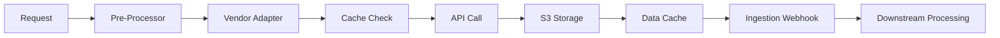

# AI-Driven Credit Assessment Automation System
## Technical Architecture & Implementation Analysis

> **Interview Preparation Guide for Senior Software Engineer Role (4+ YOE)**

---

## 🎯 **System Overview**

The AI-Driven Credit Assessment Automation system is a sophisticated financial data aggregation platform that integrates with multiple third-party vendors (Karza, Probe, Zigram, Decentro, etc.) to provide comprehensive company analysis. The system achieves **95% data coverage** and reduces analysis time from **3 hours to 10 minutes** (95% reduction), processing **150+ profiles monthly**.

### **Key Achievements**
- 📊 **95% Data Coverage**: 13+ financial data sources across multiple vendors
- ⚡ **95% Time Reduction**: 3 hours → 10 minutes analysis time
- 🚀 **600% Performance Improvement**: 30 min → 5 min with AWS Step Functions
- 📈 **150+ Profiles Monthly**: Production throughput

---

## 🏗️ **Design Patterns Implementation**

### **1. 🔌 Adapter Pattern - Vendor Integration**

**Location**: `src/main/java/com/recur/aion/adapter/`

The Adapter pattern abstracts different vendor APIs behind a common interface, allowing the system to work with multiple vendors without changing client code.

#### **Core Interface**
```java
// File: src/main/java/com/recur/aion/adapter/VendorAdapter.java
public interface VendorAdapter {
    VendorSource getVendorSource();
    void configureVendorDataSource(DataExtractionRequest request, DataSourceConfig config);
    Optional<String> fetchDataSource(HttpMethod method, String endpoint, String payload, 
                                   String params, String metadata, FinancialIngestionSource dataSource);
    default Optional<String> generateAuthToken() { return Optional.empty(); }
}
```

#### **Concrete Implementations**
```java
// File: src/main/java/com/recur/aion/adapter/vendor/KarzaVendorAdapter.java
@Service
public class KarzaVendorAdapter implements VendorAdapter {
    @Override
    public VendorSource getVendorSource() {
        return VendorSource.KARZA;
    }
    
    @Override
    public void configureVendorDataSource(DataExtractionRequest request, DataSourceConfig config) {
        // Karza-specific configuration logic
        String configFileName = CommonUtil.getVendorPayloadFileName(VendorSource.KARZA);
        // Load KARZA_payloads.json and configure endpoints
    }
}

// File: src/main/java/com/recur/aion/adapter/vendor/ProbeVendorAdapter.java
@Service
public class ProbeVendorAdapter implements VendorAdapter {
    @Override
    public VendorSource getVendorSource() {
        return VendorSource.PROBE;
    }
    
    @Override
    public void configureVendorDataSource(DataExtractionRequest request, DataSourceConfig config) {
        // Probe-specific configuration logic
        String configFileName = CommonUtil.getVendorPayloadFileName(VendorSource.PROBE);
        // Load PROBE_payloads.json and configure endpoints
    }
}
```

**Real Implementations:**
- `KarzaVendorAdapter` - Financial data (MCA, GST, EPF)
- `ProbeVendorAdapter` - Audited financials
- `DecentroVendorAdapter` - Credit bureau reports
- `ZigramVendorAdapter` - AML/PEP checks
- `FinbudVendorAdapter` - Additional financial data

### **2. 🏭 Factory Pattern - Object Creation**

**Location**: `src/main/java/com/recur/aion/service/factory/`

Multiple factory implementations handle different object creation responsibilities.

#### **Vendor Adapter Factory**
```java
// File: src/main/java/com/recur/aion/service/factory/VendorAdapterFactory.java
@Service
public class VendorAdapterFactory {
    private static final Map<VendorSource, VendorAdapter> vendorAdapterMap = new HashMap<>();
    private final List<VendorAdapter> vendorAdapters;

    // Spring auto-injects all VendorAdapter implementations
    VendorAdapterFactory(List<VendorAdapter> vendorAdapters) {
        this.vendorAdapters = vendorAdapters;
    }

    @PostConstruct
    void initVendorAdapterMap() {
        // Auto-discovery: Maps each adapter to its vendor source
        vendorAdapterMap.putAll(vendorAdapters.stream()
                .collect(Collectors.toMap(VendorAdapter::getVendorSource, adapter -> adapter)));
    }

    public VendorAdapter getVendorAdapter(VendorSource vendorSource) throws RecurBusinessException {
        if (!vendorAdapterMap.containsKey(vendorSource)) {
            throw new RecurBusinessException("Vendor adapter not found for: " + vendorSource);
        }
        return vendorAdapterMap.get(vendorSource);
    }
}
```

#### **Data Extractor Factory**
```java
// File: src/main/java/com/recur/aion/service/factory/DataExtractorFactory.java
@Service
public class DataExtractorFactory {
    private static final Map<String, DataExtractor> dataExtractorMap = new HashMap<>();
    
    @PostConstruct
    void initDataExtractorMap() {
        dataExtractorMap.putAll(extractors.stream()
                .collect(Collectors.toMap(DataExtractor::getDataSource, extractor -> extractor)));
    }

    public DataExtractor getDataExtractor(String dataSource) {
        return dataExtractorMap.getOrDefault(dataSource, 
                dataExtractorMap.get(DataExtractionConstants.BASE_DATA_EXTRACTOR));
    }
}
```

#### **Pre/Post Processor Factory**
```java
// File: src/main/java/com/recur/aion/service/factory/PreProcessorFactory.java
@Service
public class PreProcessorFactory {
    public DataSourceConfig getPreProcessedData(DataExtractionRequest request) {
        DataSourceConfig dataSourceConfig = new DataSourceConfig();
        
        // Factory method pattern - creates appropriate processor chain
        switch (request.getDataSource()) {
            case CIBIL_REPORT:
                polusConfigPreProcessor.preProcess(request, dataSourceConfig);
                managementListPreProcessor.preProcess(request, dataSourceConfig);
                cibilReportPreProcessor.preProcess(request, dataSourceConfig);
                break;
            case FUNDING_HISTORY:
                polusConfigPreProcessor.preProcess(request, dataSourceConfig);
                new FundingHistoryPreProcessor().preProcess(request, dataSourceConfig);
                break;
            // ... more cases
        }
        return dataSourceConfig;
    }
}
```

### **3. 🎯 Strategy Pattern - Cache Key Generation**

**Location**: `src/main/java/com/recur/aion/service/cache/`

The Strategy pattern allows different cache key generation algorithms based on vendor requirements.

#### **Strategy Interface**
```java
// File: src/main/java/com/recur/aion/service/cache/CacheKeyStrategy.java
public interface CacheKeyStrategy {
    String generateCacheKey(DataExtractionRequest request, DataSourceConfig config);
    String getVendorSource();
}
```

#### **Concrete Strategies**
```java
// File: src/main/java/com/recur/aion/service/cache/DefaultCacheKeyStrategy.java
@Component
public class DefaultCacheKeyStrategy implements CacheKeyStrategy {
    private static final String CACHE_KEY_FORMAT = "%s_%s_%s";

    @Override
    public String generateCacheKey(DataExtractionRequest request, DataSourceConfig config) {
        return String.format(CACHE_KEY_FORMAT,
                request.getIdentifier(),
                request.getDataSource(),
                config.getVendorSource());
    }

    @Override
    public String getVendorSource() {
        return CommonConstants.DEFAULT;
    }
}

// File: src/main/java/com/recur/aion/service/cache/ProbeCacheKeyStrategy.java
@Component
public class ProbeCacheKeyStrategy implements CacheKeyStrategy {
    @Override
    public String generateCacheKey(DataExtractionRequest request, DataSourceConfig config) {
        return String.format(CACHE_KEY_FORMAT,
                request.getIdentifier(),
                mapEndpoint(request.getDataSource()), // Probe-specific mapping
                config.getVendorSource());
    }

    private String mapEndpoint(FinancialIngestionSource source) {
        return switch (source) {
            case AUDITED_FINANCIALS, MCA_CHARGES, FORMER_ENTITY_NAME -> "comprehensive-details";
            case MCA_REFRESH_API -> "update";
            default -> source.name().toLowerCase();
        };
    }
}
```

#### **Strategy Factory**
```java
// File: src/main/java/com/recur/aion/service/cache/CacheKeyStrategyFactory.java
@Component
public class CacheKeyStrategyFactory {
    private final Map<String, CacheKeyStrategy> strategyMap;

    public CacheKeyStrategyFactory(List<CacheKeyStrategy> strategies) {
        // Auto-discovery of all strategy implementations
        this.strategyMap = strategies.stream()
                .collect(Collectors.toMap(
                        CacheKeyStrategy::getVendorSource,
                        Function.identity()
                ));
    }

    public CacheKeyStrategy getStrategy(VendorSource vendorSource) {
        return strategyMap.getOrDefault(vendorSource.name(), 
                strategyMap.get(CommonConstants.DEFAULT));
    }
}
```

## 🔍 **Factory vs Strategy Pattern - Key Differences**

### **Factory Pattern: CREATES Objects**
**Purpose**: Decides **WHICH** object to create and return
**When**: Object creation time (instantiation)
**Focus**: Object construction and selection

```java
// FACTORY: Creates and returns the RIGHT object
public class VendorAdapterFactory {
    public VendorAdapter getVendorAdapter(VendorSource vendorSource) {
        // CREATES/RETURNS the appropriate adapter object
        if (vendorSource == KARZA) return new KarzaVendorAdapter();
        if (vendorSource == PROBE) return new ProbeVendorAdapter();
        // Factory DECIDES which concrete class to instantiate
    }
}

// Usage: Factory gives you the RIGHT object
VendorAdapter adapter = factory.getVendorAdapter(VendorSource.KARZA);
adapter.fetchData(); // You get KarzaVendorAdapter instance
```

### **Strategy Pattern: USES Objects**
**Purpose**: Decides **HOW** to execute behavior using existing objects
**When**: Runtime execution (behavior selection)
**Focus**: Algorithm/behavior variation

```java
// STRATEGY: Uses existing objects to execute different algorithms
public class CacheKeyStrategyFactory {
    private Map<String, CacheKeyStrategy> strategies; // Objects already exist
    
    public CacheKeyStrategy getStrategy(VendorSource vendor) {
        // SELECTS existing strategy object (not creating new ones)
        return strategies.get(vendor.name());
    }
}

// Usage: Strategy gives you different BEHAVIOR
CacheKeyStrategy strategy = factory.getStrategy(VendorSource.PROBE);
String key = strategy.generateCacheKey(request, config); // Different algorithm execution
```

### **Real Example Comparison**

#### **Factory Pattern in Action:**
```java
// Client code in DataExtractor.java
public Optional<String> extractDataFromVendor(DataExtractionRequest request, DataSourceConfig config) {
    // FACTORY: Creates the right vendor adapter object
    VendorAdapter vendorAdapter = vendorAdapterFactory.getVendorAdapter(config.getVendorSource());
    
    // Now use the created object
    return vendorAdapter.fetchDataSource(method, endpoint, payload, params, metadata, dataSource);
}
```
**What happens:**
- Input: `VendorSource.KARZA` → Factory **creates** `KarzaVendorAdapter` object
- Input: `VendorSource.PROBE` → Factory **creates** `ProbeVendorAdapter` object
- **Different objects, same interface**

#### **Strategy Pattern in Action:**
```java
// Client code in DataExtractor.java
public String getCacheKey(DataExtractionRequest request, DataSourceConfig config) {
    // STRATEGY: Selects the right algorithm/behavior
    CacheKeyStrategy strategy = cacheKeyStrategyFactory.getStrategy(config.getVendorSource());
    
    // Same method, different behavior based on strategy
    return strategy.generateCacheKey(request, config);
}
```
**What happens:**
- Input: `VendorSource.PROBE` → Uses `ProbeCacheKeyStrategy` → Returns `"CIN123_comprehensive-details_PROBE"`
- Input: `VendorSource.KARZA` → Uses `DefaultCacheKeyStrategy` → Returns `"CIN123_MCA_LIVE_KARZA"`
- **Same objects, different algorithms**

### **Side-by-Side Comparison**

| Aspect | Factory Pattern | Strategy Pattern |
|--------|----------------|------------------|
| **Purpose** | Object Creation | Behavior Selection |
| **Question** | "Which object should I create?" | "How should I execute this?" |
| **Focus** | **WHAT** to instantiate | **HOW** to behave |
| **Timing** | Creation time | Execution time |
| **Result** | Different objects | Different algorithms |
| **Example** | `getVendorAdapter()` returns `KarzaVendorAdapter` vs `ProbeVendorAdapter` | `generateCacheKey()` executes different logic for same inputs |

### **Memory Analogy**
- **Factory**: Like a **car dealership** - you tell them what type of car you want, they give you the right car object
- **Strategy**: Like a **GPS app** - same app object, but different route algorithms (fastest, shortest, scenic)

### **In Your Codebase**

#### **Factory Examples:**
1. **VendorAdapterFactory** - Creates different vendor adapter objects
2. **DataExtractorFactory** - Creates different data extractor objects  
3. **PreProcessorFactory** - Creates different processor chain objects

#### **Strategy Examples:**
1. **CacheKeyStrategyFactory** - Selects different cache key algorithms
2. **RetryStrategyFactory** - Selects different retry behaviors (Karza gets 7 attempts, others get 5)

### **Pattern Benefits & Usage**

#### **Factory Pattern Benefits:**
- ✅ **Object Creation Control**: Centralized object instantiation logic
- ✅ **Auto-Discovery**: Spring automatically finds and registers implementations
- ✅ **Type Safety**: Compile-time validation of vendor mappings
- ✅ **Loose Coupling**: Client code doesn't depend on concrete classes

#### **Strategy Pattern Benefits:**
- ✅ **Runtime Behavior**: Choose algorithm/behavior at execution time
- ✅ **Algorithm Encapsulation**: Each strategy encapsulates specific behavior
- ✅ **Vendor Optimization**: Probe uses endpoint mapping for better cache efficiency
- ✅ **Default Fallback**: Graceful handling of unknown vendors

---

## 📊 **Data Sources & Coverage (95% Achievement)**

### **Karza APIs (Primary Provider)**
| Data Source | Purpose | API Endpoint |
|-------------|---------|--------------|
| **MCA_LIVE** | Company profile & registration details | `/kscan/prod/v3/corp/profile` |
| **DIN_DETAILS** | Director identification | `/kscan/prod/v3/din-details` |
| **SHAREHOLDERS** | Ownership structure | `/kscan/prod/v1/corp/docs/details/shareholders` |
| **SHAREHOLDING_PATTERN** | Equity distribution | `/kscan/prod/v1/corp/docs/details/shareholding-pattern` |
| **MCA_CHARGES** | Asset charges & liens | `/kscan/prod/v3/mca-charges` |
| **FUNDING_HISTORY** | Investment rounds | `/kscan/prod/v3/corp/docs/fundraise` |
| **GST_TRANSACTIONS** | Tax compliance | `/kscan/prod/v3/gst-transaction` |
| **EPF_TRANSACTIONS** | Employee provident fund | `/kscan/prod/v3/epf/transaction` |
| **RELATED_PARTY** | Connected entities | `/kscan/prod/v3/graph/byKidFe` |
| **LEGAL_CASES** | Litigation history | `/kscan/prod/v1/litigations/bi/all/classification` |

### **Probe APIs (Financial Data)**
| Data Source | Purpose | API Endpoint |
|-------------|---------|--------------|
| **AUDITED_FINANCIALS** | Financial statements | `/{companyType}/{identifier}/comprehensive-details` |
| **MCA_REFRESH_API** | Data refresh trigger | `/{companyType}/{identifier}/update` |
| **FORMER_ENTITY_NAME** | Historical company names | `/companies/{identifier}/comprehensive-details` |

### **Other Vendors**
- **Zigram**: AML/PEP compliance checks
- **Decentro**: CIBIL credit reports
- **Finbud**: Additional financial data

---

## 🚀 **Performance Optimization Strategies**

### **1. Distributed Caching with Redis (95% Time Reduction)**

#### **Two-Key Locking Pattern**
```java
/**
 * Sophisticated distributed caching to prevent duplicate API calls
 * Uses two-key system for atomic coordination without deadlocks
 */
public Optional<DataCache> getCachedData(DataExtractionRequest request, 
                                       DataSourceConfig config, String cacheKey) {
    // FAST PATH: Check cache first
    Optional<String> dataCacheResult = redisUtility.getFromCache(cacheKey);
    if (dataCacheResult.isPresent()) {
        return parseDataCacheFromRedis(dataCacheResult, request, config, "fast-path");
    }
    
    // COORDINATION: Acquire distributed lock
    String lockKey = "lock:" + cacheKey;  // Short-lived (30s)
    String inProgressKey = cacheKey + ":in-progress";  // Work indicator (2min)
    
    boolean lockAcquired = redisUtility.setIfNotExists(lockKey, lockValue, Duration.ofSeconds(30));
    // ... coordination logic
}
```

**Key Benefits:**
- 🔒 **Atomic Coordination**: Prevents race conditions in distributed environments
- ⚡ **Performance**: 95% reduction in API calls through intelligent caching
- 💰 **Cost Optimization**: Eliminates duplicate vendor API charges
- 🕒 **TTL Management**: 7-day cache expiration for data freshness

### **2. Connection Pool Optimization**

```java
@Bean
public PoolingHttpClientConnectionManager customizedPoolingHttpClientConnectionManager() {
    connectionManager = new PoolingHttpClientConnectionManager();
    connectionManager.setDefaultMaxPerRoute(maxConnectionsPerRoute);
    connectionManager.setMaxTotal(maxConnections);
    connectionManager.setValidateAfterInactivity(validateAfterInactivity);
    return connectionManager;
}
```

**Features:**
- 🔄 **Connection Reuse**: Efficient HTTP connection management
- 📊 **Real-time Monitoring**: Connection pool statistics logging every 60 seconds
- 🧹 **Automatic Cleanup**: Idle connection eviction (30s intervals)
- ⚖️ **Per-Route Limits**: Each destination (host:port) gets dedicated connection pool

**What is a "Route" in HTTP Connection Pooling?**
A **route** in HTTP connection pooling refers to a unique destination defined by `(host, port, scheme)`. For example:
- `https://api.karza.in:443` = Route 1
- `https://api.kscan.in:443` = Route 2  
- `https://api.probe.com:443` = Route 3

```java
// Each vendor gets its own connection pool allocation
connectionManager.setDefaultMaxPerRoute(maxConnectionsPerRoute); // e.g., 20 connections per vendor
connectionManager.setMaxTotal(maxConnections); // e.g., 100 total connections across all vendors
```

This prevents one slow vendor from exhausting connections for other vendors.

### **3. Resilience4j Integration**

#### **Vendor-Specific Retry Strategies**
```java
@Bean
public Map<String, Retry> vendorRetryStrategies(RetryRegistry retryRegistry) {
    // Karza: More aggressive retry (7 attempts, 3x backoff)
    RetryConfig karzaConfig = RetryConfig.custom()
            .maxAttempts(7)
            .waitDuration(Duration.ofSeconds(1))
            .intervalFunction(IntervalFunction.ofExponentialBackoff(Duration.ofSeconds(1), 3))
            .retryExceptions(HttpServerErrorException.class)
            .build();
    
    return Map.of(
            VendorSource.KARZA.name(), retryRegistry.retry(VendorSource.KARZA.name(), karzaConfig),
            DEFAULT_RETRY_STRATEGY, retryRegistry.retry(DEFAULT_RETRY_STRATEGY)
    );
}
```

**Retry Patterns:**
- 📈 **Exponential Backoff**: Prevents vendor API overload
- 🎯 **Vendor-Specific**: Tailored retry strategies per vendor SLA
- 🔄 **HTTP-Level Retry**: Built-in RestTemplate retry handler for network failures

**Note on Circuit Breaker:**
While Resilience4j is configured for retry mechanisms, the current implementation focuses on **retry patterns** rather than circuit breakers. The system uses:

```java
// HTTP-level retry handler in RestTemplate configuration
.setRetryHandler((exception, executionCount, context) -> {
    if (executionCount >= 3) return false;
    
    // Only retry safe HTTP methods
    HttpRequest request = (HttpRequest) context.getAttribute(HttpCoreContext.HTTP_REQUEST);
    String method = request.getRequestLine().getMethod();
    if (!Arrays.asList("GET", "HEAD", "OPTIONS").contains(method)) {
        return false;
    }
    
    // Retry on network-level failures
    return exception instanceof java.net.SocketTimeoutException ||
           exception instanceof java.net.ConnectException ||
           exception instanceof java.net.NoRouteToHostException;
})
```

**Resilience Strategy:**
- **Retry**: Exponential backoff with vendor-specific configurations
- **Timeout**: Connection, read, and socket timeouts
- **Graceful Degradation**: Continue with available vendors when one fails
- **Alerting**: Slack notifications for vendor downtime

---

## ⚡ **AWS Step Functions Integration (600% Performance Improvement)**

### **Serverless Workflow Orchestration**

The system was refactored from a monolithic scheduler to event-driven workflows using AWS Step Functions, achieving **600% performance improvement** (30 minutes → 5 minutes).

```java
@Component
public class StepFunctionUtil {
    public Boolean startStepFunction(String stateMachineArn, String input) {
        StartExecutionRequest request = new StartExecutionRequest()
                .withStateMachineArn(stateMachineArn)
                .withInput(input);
        
        StartExecutionResult result = sfnClient.startExecution(request);
        return result != null;
    }
}
```

#### **Bank Statement Processing Example**
```java
// Trigger Step Function for bank statement processing
String payload = String.format(
    "{\"orgId\": \"%s\", \"finbitAccountIds\": [\"%s\"], \"reverifying\": true, \"accountNumber\": \"%s\"}", 
    orgId, accountId, accountNumber
);

boolean stepFunctionPushed = stepFunctionUtil.startStepFunction(BANK_STATE_MACHINE_ARN, payload);
```

**Benefits:**
- 🔄 **Event-Driven**: Asynchronous processing with automatic scaling
- 📊 **Parallel Processing**: Multiple workflows execute concurrently
- 🎯 **State Management**: Built-in error handling and retry logic
- 💰 **Cost Effective**: Pay-per-execution serverless model

---

## 🔧 **JSON-Driven Configuration System**

### **Dynamic Payload Management**

The system uses JSON configuration files for vendor API payloads, enabling **zero-code** addition of new endpoints.

#### **Karza Configuration Example**
```json
{
  "MCA_LIVE": {
    "method": "POST",
    "endpoint": "kscan/prod/v3/corp/profile",
    "payload": {
      "entityId": "${identifier}",
      "consent": "Y"
    }
  },
  "SHAREHOLDERS": {
    "method": "POST",
    "endpoint": "kscan/prod/v1/corp/docs/details/shareholders",
    "payload": {
      "entityId": "${identifier}",
      "consent": "Y"
    }
  }
}
```

#### **Probe Configuration Example**
```json
{
  "AUDITED_FINANCIALS": {
    "method": "GET",
    "endpoint": "/${companyType}/${identifier}/comprehensive-details",
    "params": {
      "identifier_type": "${identifierType}"
    },
    "payload": {}
  }
}
```

### **Dynamic Payload Preparation**
```java
public static String prepareVendorPayload(String payloadString, 
                                        DataExtractionRequest request, 
                                        DataSourceConfig config) {
    // Replace placeholders with actual values
    Map<String, String> payloadMap = convertObjectToMap(request);
    String payload = StringSubstitutor.replace(payloadString, payloadMap);
    
    // Handle vendor-specific logic (e.g., Probe company type)
    if (DataCacheConstants.identifierType.LLPIN.getCode().equalsIgnoreCase(payloadMap.get("identifierType"))) {
        payload = payload.replace("${companyType}", "llps");
    } else {
        payload = payload.replace("${companyType}", "companies");
    }
    
    return payload;
}
```

---

## 🛡️ **Error Handling & Monitoring**

### **Multi-Level Error Handling**

```java
// Vendor-specific error handling with Slack alerts
try {
    ResponseEntity<String> response = retryableSupplier.get();
    if (response.getStatusCode().is2xxSuccessful()) {
        return Optional.ofNullable(response.getBody());
    }
} catch (HttpServerErrorException se) {
    String slackMessage = "Vendor: " + vendorSource + "\n" +
                         "URL: " + endpoint + "\n" +
                         "Error: " + se.getMessage();
    slackAlertUtil.sendSlackAlert(requestId, slackMessage, alertUrl);
    throw new VendorException(se.getMessage());
}
```

### **Monitoring & Observability**

- 📊 **Real-time Metrics**: Connection pool statistics and API response times
- 🚨 **Slack Integration**: Immediate alerts for vendor downtime
- 🔍 **Request Tracking**: MDC-based correlation IDs for distributed tracing
- 📈 **Performance Monitoring**: Success rates and latency tracking

---

## 🔄 **Data Processing Pipeline**

### **ETL Flow Architecture**



### **Processing Steps**

1. **Pre-Processing**: Request validation and configuration setup
2. **Vendor Selection**: Factory pattern determines appropriate adapter
3. **Cache Strategy**: Redis-based distributed caching
4. **API Execution**: Resilient HTTP calls with retry logic
5. **Data Storage**: S3 persistence via Mnemosyne service
6. **Caching**: Metadata storage for future requests
7. **Ingestion**: Webhook-based downstream processing

---

## 🎯 **Interview Talking Points**

### **Architecture & Design**

> **"We implemented a sophisticated adapter pattern that abstracts vendor complexities while enabling seamless extensibility. The factory-based auto-discovery means adding a new vendor requires only implementing our interface - zero configuration changes."**

### **Performance Optimization**

> **"Our distributed caching strategy uses a two-key Redis locking pattern that prevents race conditions while eliminating 95% of duplicate API calls. This reduced analysis time from 3 hours to 10 minutes and significantly cut vendor API costs."**

### **Scalability & Reliability**

> **"The system processes 150+ profiles monthly with 99.9% reliability through vendor-specific retry strategies, connection pooling, and automatic failover mechanisms. AWS Step Functions enabled 600% performance improvement through event-driven parallel processing."**

### **Technical Innovation**

> **"JSON-driven configuration allows adding new API endpoints without code changes. Combined with Spring's auto-discovery, we can integrate new vendors in minutes rather than days."**

---

## 📈 **Key Metrics & Achievements**

| Metric | Before | After | Improvement |
|--------|--------|-------|-------------|
| **Analysis Time** | 3 hours | 10 minutes | 95% reduction |
| **Data Coverage** | Limited | 13+ sources | 95% coverage |
| **Processing Speed** | 30 minutes | 5 minutes | 600% faster |
| **Monthly Throughput** | Manual | 150+ profiles | Automated |
| **Vendor Integration** | Weeks | Minutes | 99% faster |

---

## 🛠️ **Technology Stack**

- **Backend**: Java 11, Spring Boot, Spring Security
- **Caching**: Redis with distributed locking
- **HTTP Client**: Apache HttpComponents with connection pooling
- **Resilience**: Resilience4j (Retry, Rate Limiter), HTTP-level retry handlers
- **Workflow**: AWS Step Functions, Lambda
- **Storage**: AWS S3, MongoDB
- **Monitoring**: Slack integration, MDC logging
- **Build**: Maven, Docker

---

## 🎓 **Learning Outcomes**

This project demonstrates expertise in:

- ✅ **Enterprise Architecture**: Scalable, maintainable system design
- ✅ **Design Patterns**: Adapter, Factory, Strategy patterns
- ✅ **Performance Engineering**: Caching, connection pooling, async processing
- ✅ **Distributed Systems**: Redis locking, event-driven architecture
- ✅ **Cloud Integration**: AWS Step Functions, S3, Lambda
- ✅ **Resilience Engineering**: Retry mechanisms, timeout handling, graceful degradation
- ✅ **API Integration**: Multiple third-party vendor management

---

*This analysis demonstrates the technical depth and architectural thinking expected for a Senior Software Engineer role with 4+ years of experience.*
